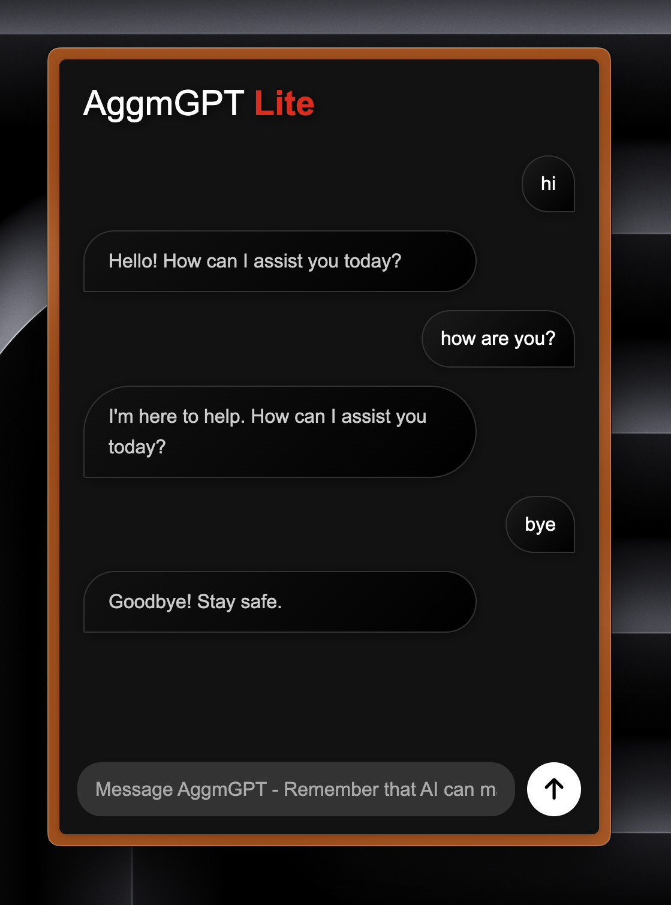

# AggmGPT-lite
AggmGPT-lite is a lightweight, rule-based conversational AI. Using pattern-matching, it provides reflective, context-aware responses to user inputs. 

Developers can build upon this model to fit their needs.
