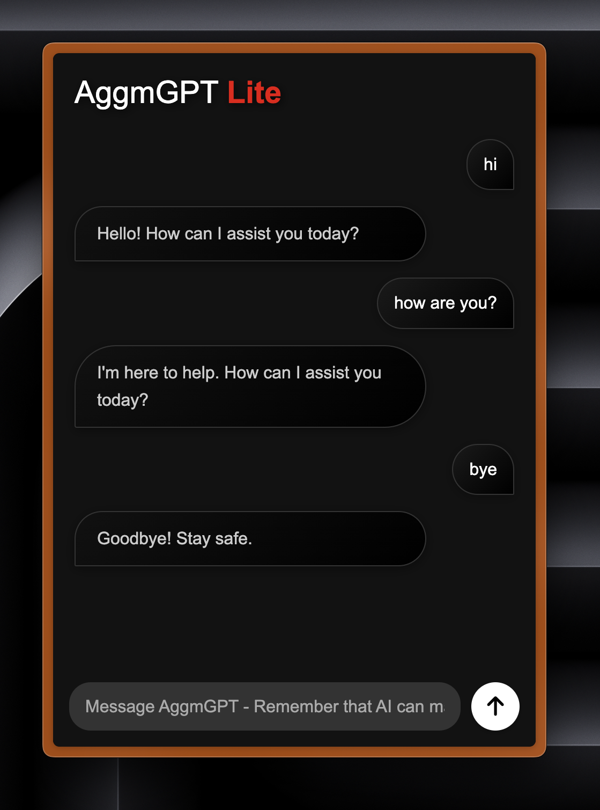

# AggmGPT-lite

AggmGPT-lite is a lightweight, rule-based conversational AI. Using pattern-matching, it provides reflective, context-aware responses to user inputs. 



Developers can build upon this model to fit their needs.

## Citation

If you use this software in your work, please cite it as follows:

```bibtex
@software{AggmGPT-lite,
  author = {Adolfo GM},
  title = {AggmGPT-lite},
  url = {https://github.com/Adolfo-GM/AggmGPT-lite},
  year = {2024}
}
```
